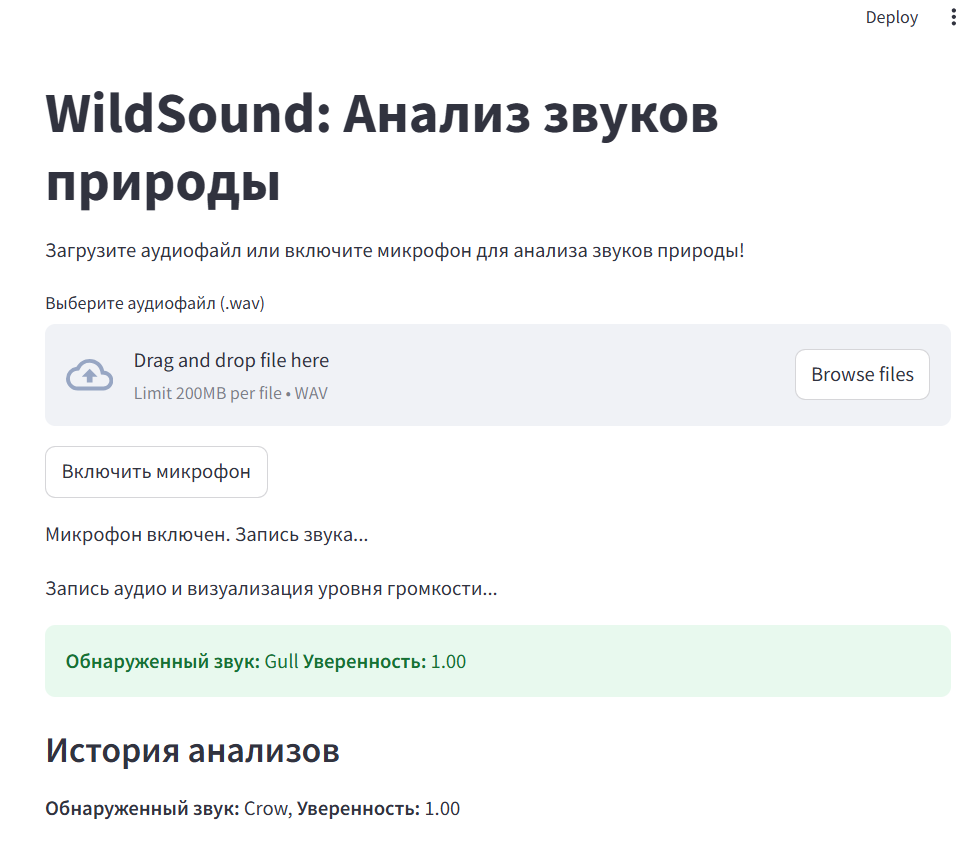
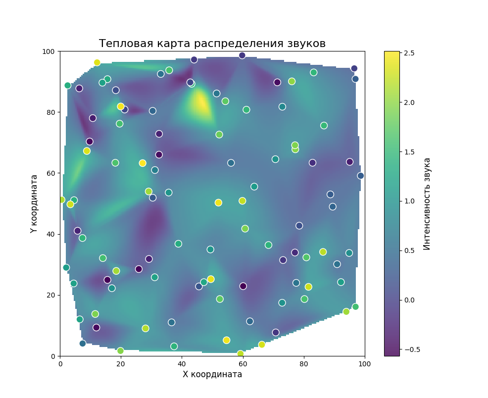

# WildSound: Анализ звуков природы

WildSound — это приложение, использующее искусственный интеллект для анализа шумов в окружающей среде. Программа может слушать звуки, определять их природу и классифицировать их на основе предобученной модели YAMNet. Этот инструмент имеет множество возможных применений, включая:

- **Мониторинг популяций животных**: определение и анализ звуков животных, перемещение и поведение популяций.
- **Создание карт активности**: с использованием портативных устройств можно анализировать изменения в популяциях и экосистемах на больших территориях.
- **Анализ качества среды**: выявление шумового загрязнения, активности машин или людей в природных зонах.
- **Нацеленность на вид**: настройка для анализа определённых видов звуков (например, для мониторинга редких птиц).

## Особенности

- Воспроизведение звуков через микрофон в реальном времени.
- Анализ загруженных аудиофайлов форматов `.wav` и `.mp3`.
- Интерфейс, который предоставляет список обнаруженных звуков и их уверенность.
- Простое управление включением и выключением записи микрофона.
- История анализов доступна прямо в приложении.
- Возможность визуализации уровня громкости в реальном времени.

## Технические детали

WildSound использует предобученную модель YAMNet, разработанную Google, для классификации звуков. Модель способна распознавать более 500 типов звуков, включая шумы природы, человеческую речь и механические звуки.

Программа написана на Python с использованием следующих библиотек:
- TensorFlow Hub
- Streamlit
- Librosa
- SoundDevice
- Matplotlib

## Пример интерфейса




На изображении показан пример пользовательского интерфейса с текущим анализом звуков и историей обработанных записей.

## Установка

1. Убедитесь, что у вас установлен Python 3.9.
2. Установите зависимости:
   ```bash
   pip install -r requirements.txt
